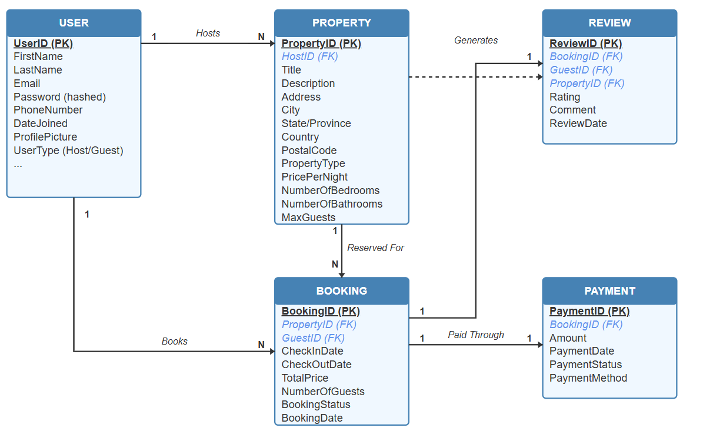

# ALX AirBnB Database Schema

## Overview

This project implements a relational database schema for an AirBnB-like accommodation booking system. The schema follows Third Normal Form (3NF) principles to ensure data integrity and minimize redundancy.

## Schema Design

The database consists of nine tables:

1. **User** - Stores information about users who can be hosts or guests
2. **Address** - Stores location data for properties
3. **Property** - Contains details about accommodation listings
4. **PropertyAmenity** - Catalog of available amenities
5. **PropertyAmenityMapping** - Maps properties to their amenities (many-to-many)
6. **PropertyAvailability** - Tracks when properties are available
7. **Booking** - Records reservation details
8. **Review** - Stores guest feedback after stays
9. **Payment** - Handles transaction information for bookings

### Entity Relationship Diagram



*Note: Please refer to the ER diagram file in the repository for a visual representation of the database schema.*

## Schema Highlights

- **Normalized Design**: The schema follows 3NF principles to reduce redundancy and maintain data integrity
- **Appropriate Constraints**: Includes PRIMARY KEY, FOREIGN KEY, UNIQUE, CHECK constraints
- **Optimized Indexes**: Strategic indexes on frequently queried columns
- **Data Validation**: CHECK constraints ensure data validity (e.g., prices > 0, valid date ranges)
- **Referential Integrity**: FOREIGN KEY constraints with appropriate actions (CASCADE, RESTRICT)
- **Timestamps**: Automatic creation and update timestamps where relevant

## Implementation Details

### Notable Features

1. **Address Normalization**: Extracted address information into a separate table
2. **Flexible Amenity System**: Many-to-many relationship between properties and amenities
3. **Availability Management**: Dedicated table for tracking property availability periods
4. **Booking Business Rules**: Enforces logical constraints like check-out date being after check-in date
5. **Automatic Timestamps**: Triggers to maintain updated timestamps
6. **Status Enumerations**: Defined states for properties, bookings, and payments

### Data Types

- Text data uses VARCHAR with appropriate length limits
- Monetary values use DECIMAL(10,2) for precision
- Dates use DATE or DATETIME types as appropriate
- Boolean flags for simple yes/no states

## Usage

### Installation

1. Clone the repository:
   ```
   git clone https://github.com/Marcos-MEDENOU/alx-airbnb-database.git
   cd alx-airbnb-database/database-script-0x01
   ```

2. Run the schema script in your SQL database:
   ```
   sqlite3 airbnb.db < schema.sql
   ```
   or
   ```
   mysql -u username -p airbnb_db < schema.sql
   ```

### Notes On Database Choice

The schema is written to be compatible with most SQL databases with minor adjustments:

- For SQLite: Remove the INDEX statements and ENUM types
- For MySQL: Use as-is
- For PostgreSQL: Replace AUTOINCREMENT with SERIAL and adjust ENUM syntax

## Extensions and Future Work

Potential enhancements to consider:

1. Add user roles and permissions system
2. Implement transaction logging tables
3. Add support for multiple property photos
4. Create pricing variations tables for seasonal pricing
5. Add tables for messaging between hosts and guests

## License

This project is part of the ALX Software Engineering program.